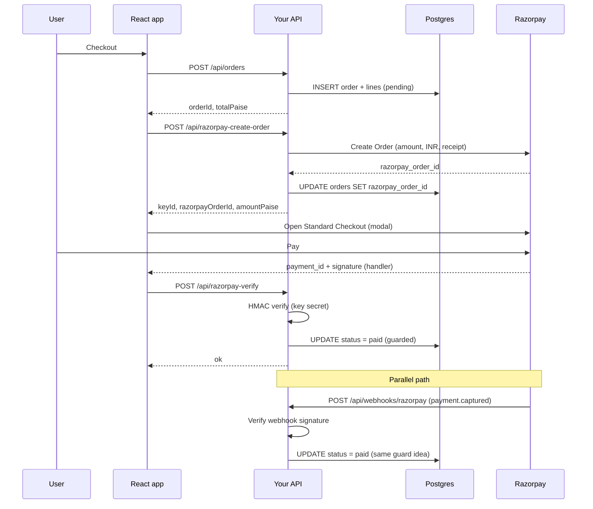

# Razorpay payment flow (this repo)

End-to-end reference for how checkout, verification, and webhooks fit together. Implementation lives under `api/razorpay-create-order.ts`, `api/razorpay-verify.ts`, `api/webhooks/razorpay.ts`, and `src/lib/razorpayCheckout.ts` / `src/lib/razorpayFlow.ts`.

See also [PHASES.md](./PHASES.md) Phase 5.

---

## Flowchart (happy path + skip + webhook)

```mermaid
flowchart TB
  subgraph Browser["Browser (SPA)"]
    A[User: Complete purchase] --> B["POST /api/orders\n(cart lines)"]
    B --> C{201 orderId + totalPaise?}
    C -->|no| E[Show error]
    C -->|yes| D["POST /api/razorpay-create-order\n{ orderId }"]
    D --> F{Keys configured?}
    F -->|no: skipped| G["sessionStorage checkoutRazorpaySkipped\nPURCHASE_SUCCESS → /checkout"]
    F -->|yes| H[Load Checkout.js + open modal\nkey, order_id, amount, INR]
    H --> I[User pays on Razorpay\n(UPI / card / etc.)]
    I --> J["Checkout handler:\nrazorpay_payment_id, order_id, signature"]
    J --> K["POST /api/razorpay-verify\n(HMAC: order_id|payment_id)"]
    K --> L{Valid + pending row matches?}
    L -->|yes| M["DB: status = paid\nPURCHASE_SUCCESS → /checkout"]
    L -->|no| N[Show verify error]
  end

  subgraph Razorpay["Razorpay"]
    R1[Orders API:\nRazorpay Order created] --- H
    R2[Payment captured] --- I
  end

  subgraph Server["Your API (Vercel)"]
    B
    D
    K
    W["POST /api/webhooks/razorpay\npayment.captured"]
  end

  subgraph DB["Postgres"]
    P1[(orders: pending,\nrazorpay_order_id set)]
    P2[(orders: paid)]
    B --> P1
    D --> P1
    K --> P2
    W --> P2
  end

  R2 -.->|async| W
  W -->|X-Razorpay-Signature\nvs raw body| P2
```

---

## Sequence diagram



---

## What each piece does

| Piece | Role |
| ----- | ---- |
| `POST /api/orders` | Your source of truth: line items, `totalPaise`, initial `pending` status. |
| `POST /api/razorpay-create-order` | Creates a **Razorpay Order** for that amount; stores `razorpay_order_id` on your row. |
| Checkout.js modal | Razorpay-hosted UI; user pays; returns **payment id + signature** to the handler. |
| `POST /api/razorpay-verify` | Verifies the callback (HMAC with **RAZORPAY_KEY_SECRET**); sets **paid** when the browser returns. |
| `POST /api/webhooks/razorpay` | Same **paid** transition when the client does not finish verify (e.g. tab closed). Listens for `payment.captured`; uses **RAZORPAY_WEBHOOK_SECRET** on the **raw** body. |
| Skipped path (no keys) | No Razorpay call; order stays **pending**; `sessionStorage` flag `checkoutRazorpaySkipped` drives checkout copy. |

---

## Env vars (server)

| Variable | Used for |
| -------- | -------- |
| `RAZORPAY_KEY_ID` | Passed to Checkout; create order API. |
| `RAZORPAY_KEY_SECRET` | Create orders; verify `razorpay_verify` signature (`order_id\|payment_id`). |
| `RAZORPAY_WEBHOOK_SECRET` | Verify `X-Razorpay-Signature` on webhook payload. |

---

## Viewing these diagrams

- GitHub renders Mermaid in Markdown on push.
- VS Code / Cursor: preview Markdown with a Mermaid-capable extension, or paste into [mermaid.live](https://mermaid.live).
